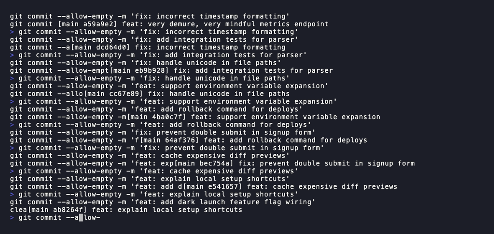

# zsh-halfpipe

Edit the downstream side of a shell pipeline and see its output update live, without re-running the upstream side.

`zsh-halfpipe` lets you iterate on filters, regexes, and other pipeline stages in place by pressing `Ctrl-G`.



```zsh
git log --oneline | grep -E "fix"
```

Hit `Ctrl-G`. Now refine the regex — change it to `"fix|feat"`, then `"^[a-f0-9]+ (fix|feat):"` — and see what matches instantly. The left side runs once; you iterate on the right without re-running `git log`.

Great for getting a regular expression right without executing the full pipeline on every attempt.

- The upstream command is cached on activation and shown in cyan.
- Press `Ctrl-X Ctrl-G` to re-run the upstream and refresh the cache.
- Press `Ctrl-G` again to exit. Press `Enter` to run the final command normally.
- Preview mode only live-executes explicitly allowlisted, stream-oriented commands. By default that list is `awk`, `sed`, `grep`, `head`, `tail`, `tr`, `cut`, `sort`, `uniq`, `wc`, `cat`, `nl`, `column`, and `jq`.

## How it works

- Preview commands run in a `zsh -fc` subprocess hydrated with your current aliases and functions.
- `Ctrl-G` is borrowed while a pipeline is on the command line and restored when you exit.
- `Ctrl-X Ctrl-G` is bound while preview mode is active and released on exit.
- Output is cached when you first activate preview. Use `Ctrl-X Ctrl-G` to refresh it.
- Commands outside that allowlist are not executed in preview mode, even without globs. This avoids live-running `perl`, ad-hoc scripts, or destructive commands like `rm`.
- If you want to allow additional preview commands, set `HALFPIPE_PREVIEW_COMMAND_ALLOWLIST` before sourcing the plugin.

```zsh
typeset -ga HALFPIPE_PREVIEW_COMMAND_ALLOWLIST=(awk sed grep head tail tr cut sort uniq wc cat nl column jq)
source ~/.local/share/zsh-halfpipe/halfpipe.zsh
```

## Installation

### Manual (recommended — no plugin manager required)

This works whether you're using plain Zsh, Oh My Zsh, or any other setup.

```zsh
mkdir -p ~/.local/share
git clone https://github.com/raimo/zsh-halfpipe.git ~/.local/share/zsh-halfpipe
```

Then add this line to your ~/.zshrc:

```zsh
source ~/.local/share/zsh-halfpipe/halfpipe.zsh
```

### Oh My Zsh

```zsh
git clone https://github.com/raimo/zsh-halfpipe.git ${ZSH_CUSTOM:-~/.oh-my-zsh/custom}/plugins/zsh-halfpipe
```

Then add zsh-halfpipe to your plugins array in ~/.zshrc:

```zsh
plugins=(git zsh-halfpipe …)
```

### With plugin managers

#### zinit

```zsh
zinit light raimo/zsh-halfpipe
```

#### Antigen

```zsh
antigen bundle raimo/zsh-halfpipe
```

#### Any other manager that can source a root-level `.plugin.zsh` file should work too.

The repo keeps the implementation in `halfpipe.zsh` and exposes a root-level
`zsh-halfpipe.plugin.zsh` entrypoint for Oh My Zsh and other plugin managers
that auto-detect `*.plugin.zsh` files.

## Uninstallation

Just remove the source line (or the plugin name from the plugins= array) and delete the cloned directory.

## Development

Syntax-check the script with:

```zsh
zsh -n halfpipe.zsh
```

Run the plugin test suite with:

```zsh
zsh tests/run.zsh
```

Mutation-check the test harness with:

```zsh
zsh tests/test-the-test.zsh
```

The repo intentionally keeps the implementation in a single file so it can be sourced directly by shell plugin managers.

## Disclaimer and AI use

This software is provided as-is, without warranty of any kind, and you use it at your own risk. By using it, you accept full responsibility for reviewing what it does in your environment; the author disclaims liability for any loss, damage, or disruption resulting from its use. See [LICENSE](LICENSE) for the full license terms.

Core logic for this tool was created by a human and has been used daily in real workflows. AI was used to improve test coverage, help with documentation, and fix corner cases revealed by the test harness; it was not the origin of the core interaction design or primary implementation logic.
